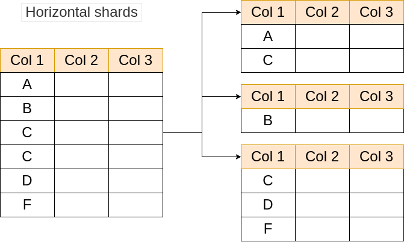

# System Design

## Example 

### Online Social Networking Website Design (Twitter)

Knowing thing

- Can post tweet
- Timeline
- Follow
- ...

## System Design Interview Signals

1. Work solution
2. Analysis and communication
3. Tradeoff Pros/Cons
   1. Following the requirement solving problem
4. Knowledge base
   1. Where should you put the cache 
   2. How to updat the cache

## Overview

- Understanding requirement (Clarify the requirement)
- Capacity Estimation
- System APIs
- High-level System Design
- Data Storage
- Scalability

## Step 1 Clarify the requirement

Don't follow the thing in you mind, Ask the client what that need.
The main goals

- Requirement
- Traffic size (e.g., Daily Active User)

### Type 1: Functional Requirement

1. Tweet
   1. Create
   2. Delete
2. Timelime/Feed
   1. Home ( overall content )
   2. User ( Focus at User )
3. Follow a user
4. Like a tweet
5. Search tweets
6. ...

### Type 2: Non-Functional Requirement ( Example )

- Consistency 
  - Get recently contents
    - Ex. when Other person post a new tweet, can be real time showing
  - Sacrifice: Eventual consistency
    - Reason: not effect the final User Experience
- Availavility
  - Every request receive a (non-error) response, without the guarantee that it contains the most recent write
  - System must be **Scalabble**
    - Performance: low Latency
    - Ex. High loading
- Partition tolerance (Fault Tolerance)
  - The system continues to operate despite and arbitrary nubmer of message being dropped (or delayed) by the network between nodes.

## Step 2: Capacity Estimation

The main point of those analysis

- Understand where is the bottleneck

### Assumption (Example)

- 200 million DAU, 100 million new tweets
- Each user: visit home timeline 5 time; other user timeline 3 times
- Each timeline/page has 20 tweets
- Each tweet has size 280 (104 characters) bytes, metadata 30bytes
  - Per photo: 200KB, 20% tweets have images
  - Per video: 2MB, 10% tweets have video, 30% videos will be watched

### Storage Estimate ( Example )

- Write size daily:
  - Text: 100M new tweet * (280 + 30) Bytes/tweet = 31GB/day
  - Image: 100M new tweets * 20% has image * 20KB per image = 4TB/day
  - Videos: 100M new tweets * 10% has videos * 2MB per videos = 20TB/day
- Totals:
  - 31GB + 4TB + 20TB = 24TB/day

### Bandwidth Estimate

**Daily read tweets volume**

- 200 M * ( 5 home visit + 3 user visit ) * 20 tweets / page = 32B tweets/day

**Daily Read bandwidth**

- Text: 32B * 280 bytes / 86400 = 100MB/s
- Image: 32B * 20% tweets has image * 200 KB per image / 86400 = 14GB/s
- Videos: 32B * 10% tweets has videos * 30% got watched * 2MB per video / 86400 = 20GB/s
- Total: 35GB/s

## Setp 3: System APIs

Notes: [opt] is optional

### Data Structure:

- String **userToken**
  - for authorized use
- Int **tweet_id**
  - for search which tweets
- String **tweet** ( contents )
  - content from user
- Int **pageSize** ( IDK )
- bool **like**
  - user like or unlike
- [opt] String **pageToken**
  - using for turning page

### API Structure:

- postTweet( **userToken**, **tweet** )
- deleteTweet( **userToken**, **tweet_id** )
- likeOrUnlikeTweet( **userToken**, **tweet_id**, **like** )
- readHomeTimeline( **userToken**, **pageSize**, [opt] **pageToken** )
- readUserTimeline( **userToken**, **pageSize**, [opt] **pageToken** )

## Step 4: High-level System Design

### Scenario 1: Post Tweets

.png)

### Scenario 2: Visit User Timeline

.png)

### Scebarui 3: Visit Home Timeline

#### Special Structure:

- Fan out on write ( Update cache with User post a new tweets )
  It's only a method **twitter** do ( Warning: this description may be wrong )
  1. Get followers info
  2. Write a list for relative users ( Home timeline )
  3. With user read the recent timeline, will return the thing at cache.

.png)

#### Home Timeline ( cont'd )

### Naive soltion: Pull mode

- How 
  - Fetch tweets from N followers from DB, merge and return
- Pros
  - Write is fast: `O(1)`
- Cons
  - Read is slow: `O(N)` DB reads

 ### Better solution: Push mode

- How 
  - Maintain a feed list in cache for each user
  - Fanout on write
- Pros
  - Read is fast: `O(1)` from the feed list in cache
- Cons
  - Write needs more efforts: O(N) write for each new tweet
    - Async tasks
  - delay in showing lastest tweets `(evetual consistency)`

### Fanout on write ( worst situation )

- Non-realtime users ( Ex. Zoombie or Offline Users )
  - With write take `O(N)`, the most needed user can not been update as realtime
  - Solution: **Hybrid Solution**

#### Hybrid solution

- Non-hot users:
  - fan out on write ( Push ): write to user timeline cache
  - do not fanout on non-active users
- Hot users:
  - fan in on read ( Pull ): read during timeline request from tweets cache , and aggregate with results from non-hot users

## Step 5: Data storage

### SQL Structure

Notes: **PK** Primary Key

#### Users Table

| PK   | userID: Integer        |
| ---- | ---------------------- |
|      | name: varchar(256)     |
|      | email: varchar(100)    |
|      | creationTime: DateTime |
|      | lastLogin: DateTime    |
|      | isHotUser: Boolean     |

#### Tweet Table

| PK   | tweetID: Integer             |
| ---- | ---------------------------- |
|      | userID: Integer ( relative ) |
|      | creationTime: DateTime       |
|      | content: varchar(140)        |
|      | ...                          |

#### Followers Table

| PK   | Columns          |
| ---- | ---------------- |
|      | userID1: Integer |
|      | userID2: Integer |

### Type of Data Storage Method

- SQL database
  - relational data
    - E.g., user table
  - Non-relational data
    - E.g., timeline
  - File System
    - E.g., Media or Large Files
      - Media files: image, audio, video ...

## Step 6: Scalability

- Identify porential bottlenecks
- Discussion solutions, focusing on tradeoffs
  - Data sharding
    - Data store, cache
  - Load balancing
    - E,g,m `User <-> application server; appication server <-> cache server; application server <-> DB`
  - Data caching
    - Read heavy

### Sharding

- Why?
  - Impossible to store/process all data in a single machine
- How?
  - Break large tables into smaller shards on multiple servers
- Pros
  - Horizontal scaling
- Cons
  - Complexity ( distributed query, resharding )

### Sharding ( Cont'd )

Options: Shard by tweet's **Creation Time**

- Pros:
  - Limited shards to query

- Cons:
  - Hot/Cold data issue
  - New shards fill up quickly

.png)

Option 2: Shard by **hash ( userid )**

- Pros
  - Simple
  - Query user timeine is straightforward
- Cons
  - Home timeline still needs to query multiple shards
  - Non-uniform distribution of storage
    - User data might not be able to fit into a single shard
  - Hot users
  - Availability ( Hot data )

Option 3: Shard by **hash ( tweetid )**

- Pros
  - Uniform distribution
  - High availability
- Cons
  - Need to query all shards in order to generate user / home timeline

### Caching

- Why
  - Distributed queries can be slow and costly
  - heavy read traffic ( at qaaSocial Network )
- How
  - Store hot / precomputed data in memory, reads can be much faster
- Timeline service
  - User timeline: user_id → {tweet_id} # Varies a lot = 1k~100k, Trump: ~60k
  - Home timeline: user_id → {tweet_id} # This can be huge, sum(followee' tweets)
  - Tweets: tweet_id → tweet # Common data that can be shared
- Topic
  - Caching policy
  - Sharding
  - Performance